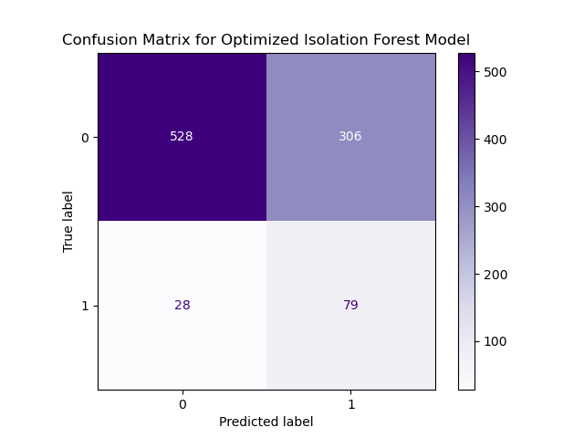
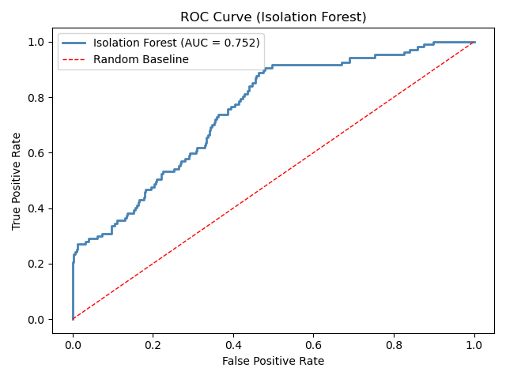
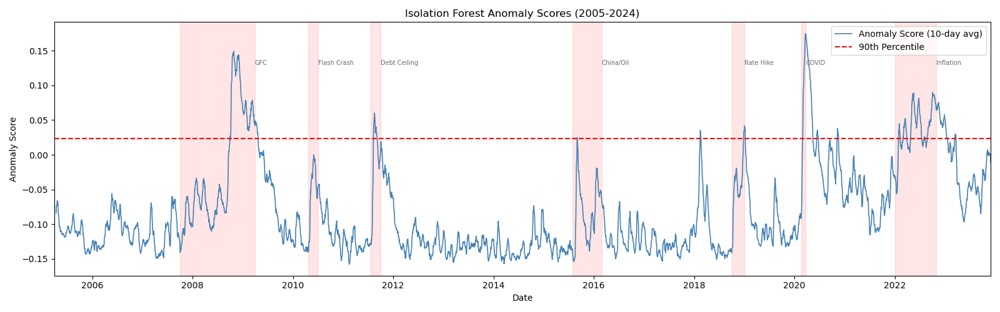

# Unsupervised Machine Learning Method

## Research Question

For my project, I wanted to determine if market data can be used to predict whether the market is in crisis. In this portion of my work, I apply an anomaly detection model, Isolation Forest, in order to determine how anomaly detection without a clearly defined label compares to the target label used in my supervised models (VIX at close > 30). 

## Model: Isolation Forest

### Baseline Model:

**Hyperparameters:**  

- contamination 0.09
- max_features 1.0
- min_samples 'auto'
- n_estimators 100

**Validation:**  

- Train-test split of 80/20

**Performance Metrics:**  

- ROC-AUC score: 0.746
- Macro average F1 score: 0.51
- Weighted average F1 score: 0.67

### Optimized Model (AUC score):

**Hyperparameters:**  

- contamination 0.07
- max_features 0.75
- min_samples 125
- n_estimators 300

**Validation:**

- Train-test split of 80/20

**Performance Metrics:**

- ROC-AUC score: 0.752
- Macro average F1 score: 0.54
- Weighted average F1 score: 0.71

## Analysis

Even after optimization, the isolation forest struggled when anomally detection was evaluated against the defined taret label used in my supervised models. However, the Isolation forest did report an AUC score of 0.75, meaning that the is still very informative in terms of predicting market anomaly. Given two random dates, one being a crisis day, and one being a normal day, there is a 75% that the crisis day gets a higher anomaly score. 

The graph above compares the assigned anomaly scores from between the years 2005-2024. The red shaded areas market periods of time that were historically reported as significant market crashes. By looking at this graph we can see that, despite the Isolation Forest not performing well at predicting crahses based on the target label, the model does appear to capture market crashes relatively well.

